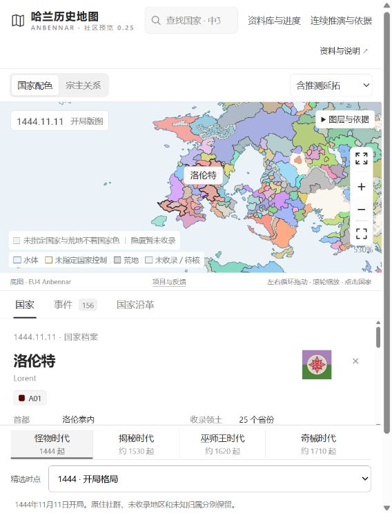
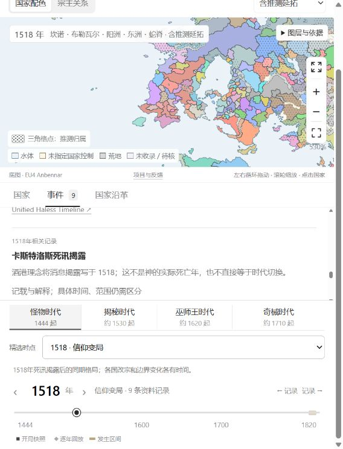
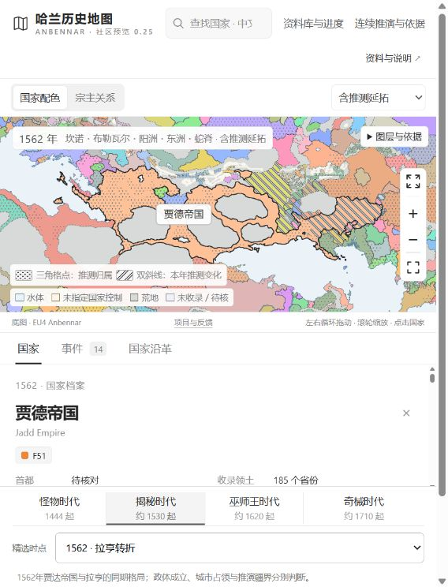
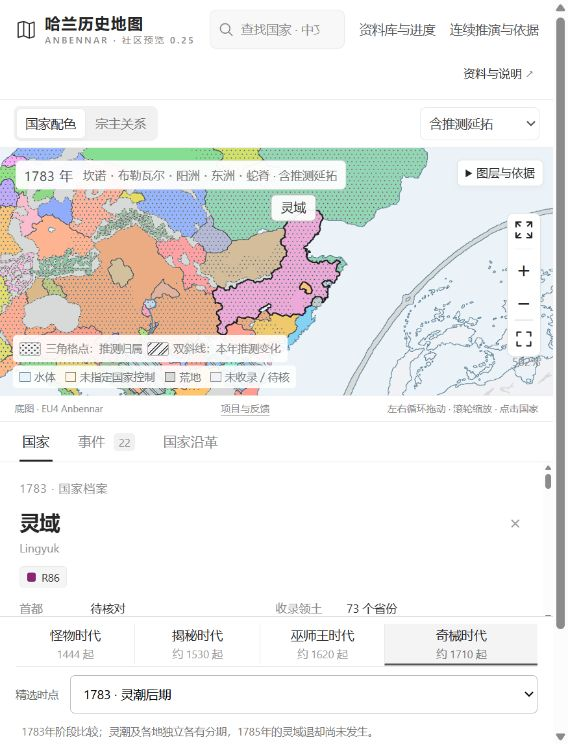
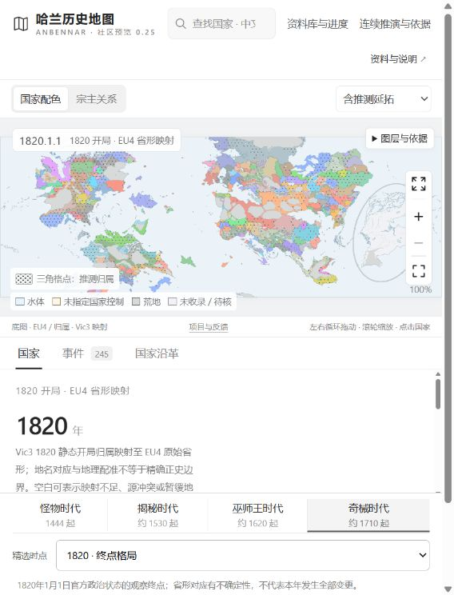
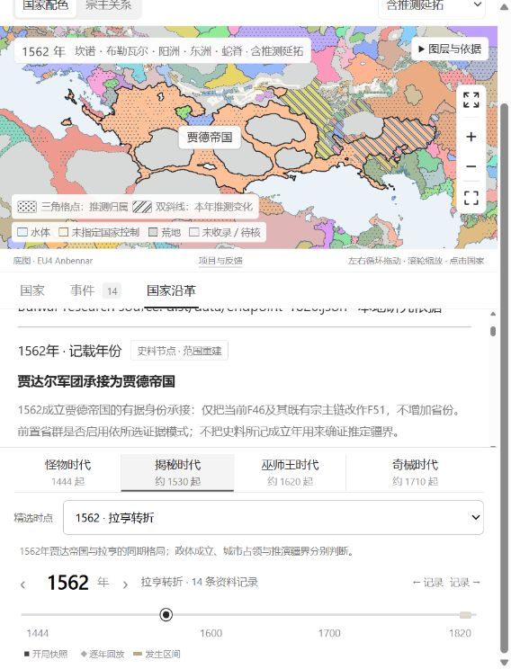
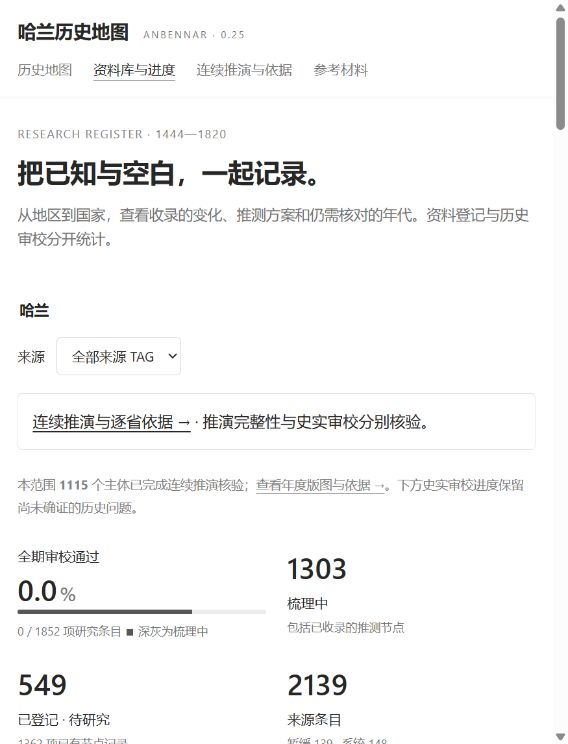
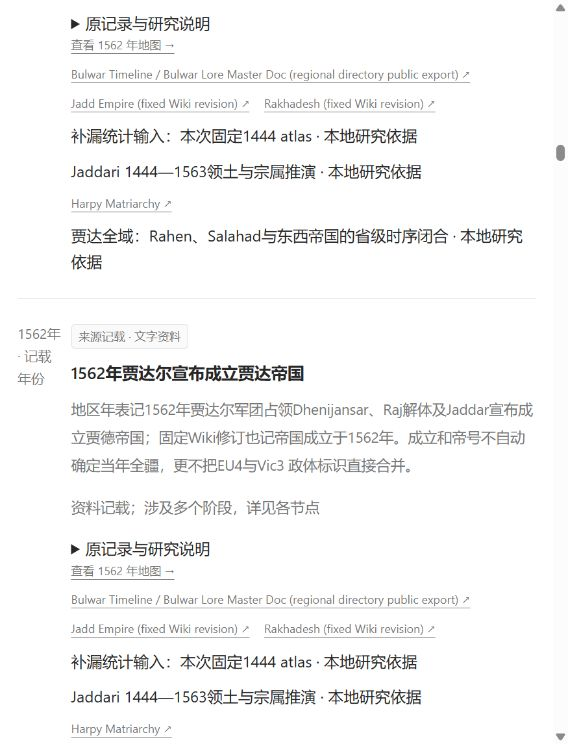

# 网页截图与简短介绍

以下图片为2026-09-23社区预览的实际网页截图，可单独保存，并复制相应配文。截图未重绘地图或改写页面文字；保留了当时的年份、资料模式及可见限定。截图中的模组地图、旗帜和引用内容仍保留各自上游归属，见[第三方说明](../../THIRD_PARTY_NOTICES.md)。

[打开网站](https://shen-hhao.github.io/anbennar-timeline/) · [纯文本配文](captions.txt) · [参与贡献](../../CONTRIBUTING.md)

## 可直接复制的简要介绍

哈兰历史地图现已开放社区预览！在同一张地图上切换1444—1820年的局势，查看国家与宗属、年度事件和国家沿革，也可以进入资料库追溯来源、了解推演依据与未决问题。欢迎安本纳尔玩家一起补充史料、校对译名、报告地图问题。

这是非官方社区研究项目。部分年代、边界和政权变化属于推测，不一定是官方正史；资料库仍不完善，内容可能有缺漏或版本冲突，请结合原文和限定阅读。

网站：https://shen-hhao.github.io/anbennar-timeline/

反馈：https://github.com/shen-hhao/anbennar-timeline/issues/new/choose

## 01 · 从1444年的坎诺出发

搜索或点击国家，查看它的位置、名称、标识旗帜与已收录信息。以洛伦特为例，从EU4开局进入哈兰的历史地图。

## 02 · 地图旁边，就是这一年的故事

切换到1518年，在事件面板阅读卡斯特洛斯死讯揭露等记录。事件的记载年份、解释与限定分别展示；消息揭露年不等于实际死亡年。

## 03 · 1562年，贾德帝国与拉亨的转折

在同一底图上比较贾德帝国与拉亨的同期局势。国家成立、城市占领和具体省界分别判断，有据的成立年不代表所有疆界都已确证。

## 04 · 灵潮后期的东洲

查看1783年的灵域与周边格局，沿时间轴观察地区变化。部分边界与显示年份含推演；本图不表示灵潮在1783年结束。

## 05 · 从1444走到1820

将Vic3的1820开局资料映射到同一EU4底图，方便对照前后格局。1820是终点观察，不代表所有建国或转属都在这一年发生，跨图省形对应也有不确定性。

## 06 · 沿着一个国家，读它的历史

国家沿革把相关记录串在一起，并提供返回对应年份地图的入口。以贾达尔军团到贾德帝国的承接为例，区分史料节点与推定疆域。

## 07 · 把已知与空白，一起记录

资料库按地区和国家整理已有记录，也展示待研究条目与未决问题。图中的“全期审校通过”是严格的历史审校指标，不是网站开发完成度；已有收录和连续推演核验不等于完整历史已被确证。

## 08 · 不只看结论，也能查依据

进入国家资料页，查看专题说明、来源链接和研究状态。政体存在有据，不等于它的全部存续年代与领土边界都已明确。

## 09 · 一条事件，也保留它的证据边界

记录附带日期说明、原记录入口和来源链接，并可跳回相应年份的地图。读到“1562年成立”，也能同时看到为什么这不能直接证明当年的全部疆域。

## 转发时建议保留的一句话

非官方社区历史地图，含有明确标注的推演，资料库仍在补充；欢迎携来源与不同解释共同修正。

图片展示的是当次真实页面状态，不是新的历史采用或完整性认证。部分截图在滚动后的页面位置拍摄；当前版本与后续网站可能有差异。
